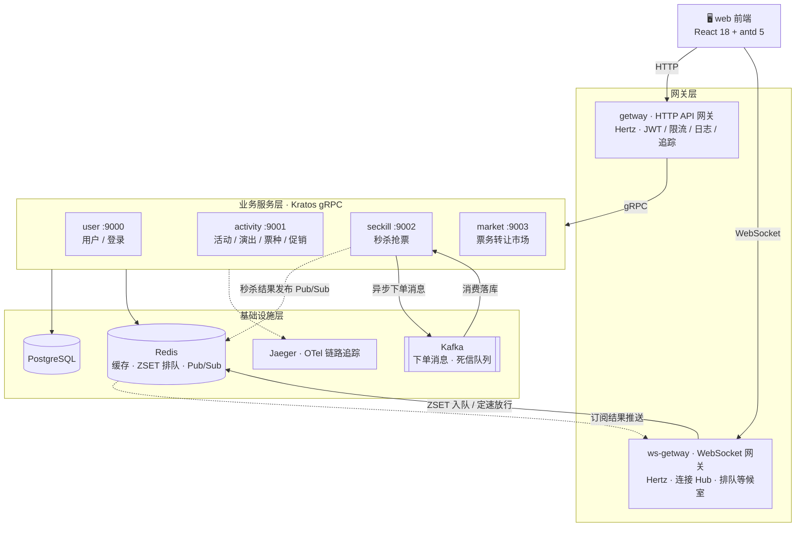
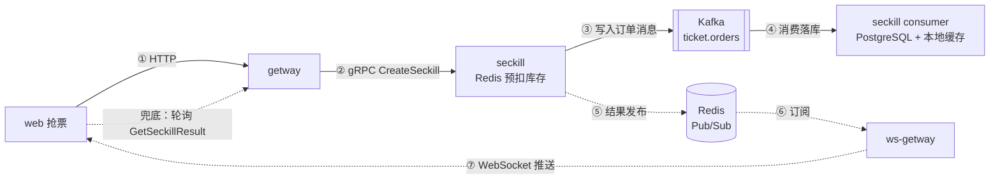
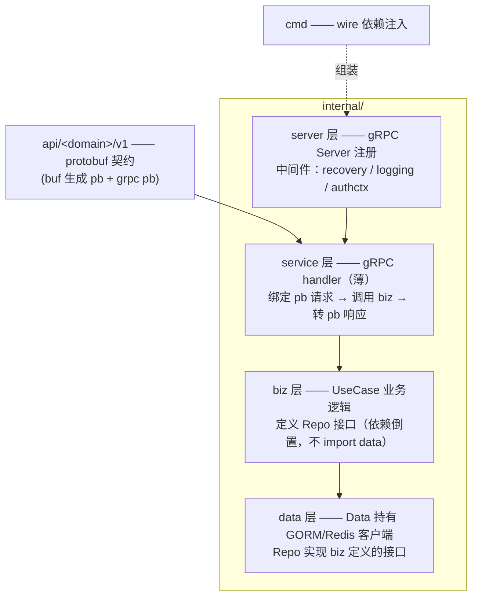

# sale

在线票务 / 抢票系统：活动管理、秒杀抢票（排队等候室 + Kafka 异步下单 + WebSocket 实时推送）、票务转让市场。Go 微服务（Kratos / Hertz）+ React 前端。

## 目录结构

```text
sale
├── apps/                        # 应用层（微服务 + 前端）
│   ├── activity/                # 活动服务 (Kratos) —— 活动 / 演出 / 票种 / 促销码 / 统计 / 转让
│   ├── getway/                  # HTTP API 网关 (Hertz + hz) —— 路由聚合、JWT 鉴权、限流、日志
│   ├── market/                  # 票务市场服务 (Kratos) —— 转让挂单 / 交易市场
│   ├── seckill/                 # 秒杀服务 (Kratos) —— 抢票核心：Redis 预扣 + Kafka 异步落库
│   ├── user/                    # 用户服务 (Kratos) —— 注册 / 登录 / 用户信息
│   ├── web/                     # 前端 (React 18 + antd 5 + zustand + Vite)
│   └── ws-getway/               # WebSocket 网关 (Hertz) —— 排队等候室、秒杀结果实时推送
├── desc/                        # 数据库迁移 SQL（golang-migrate 格式）
├── docs/                        # 设计文档（排队等候室、秒杀 WS 推送等）
├── model/                       # 跨服务公共领域模型 (event / ticket / market / stats)
├── pkg/                         # 公共基础库
│   ├── authctx/                 # 认证上下文：gRPC metadata 透传用户身份
│   ├── cache/                   # 本地缓存
│   ├── conf/                    # 配置定义（protobuf）
│   ├── database/                # PostgreSQL 封装
│   ├── notification/            # Kafka 生产者 / 消费者封装（franz-go，含死信队列）
│   ├── rdb/                     # Redis 客户端封装
│   ├── trace/                   # OpenTelemetry 链路追踪
│   ├── utils/                   # 工具：SonyFlake ID 生成、加解密、时间等
│   └── ws/                      # WebSocket 封装
├── Makefile                     # 根级构建命令
├── buf.gen.config.yaml          # buf (protobuf) 生成配置
├── go.mod / go.sum              # 根模块依赖
├── go.work / go.work.sum        # Go workspace（聚合各服务模块）
└── README.md
```

单个微服务（Kratos）内部结构：

```text
apps/<service>/
├── api/<domain>/v1/       # protobuf 接口与消息定义（buf 生成 pb 代码）
├── cmd/<service>/         # main 入口 + wire 依赖注入
├── configs/config.yaml    # 服务配置（端口 / PostgreSQL / Redis / Kafka）
├── internal/
│   ├── service/           # gRPC Service 实现：参数处理，桥接 api → biz
│   ├── biz/               # 业务用例层（核心逻辑）
│   ├── data/              # 数据访问层：PostgreSQL / Redis
│   └── server/            # gRPC Server 注册、Kafka Consumer 托管
└── openapi.yaml           # OpenAPI 文档（由 proto 生成）
```

## 架构图

### 总体架构



### 秒杀核心链路



- 排队等候室：`ws-getway` 基于 Redis ZSET（`ZADD NX` 去重入队）按固定速率放行，削峰填谷
- 异步下单：秒杀请求经 Redis 预扣后写入 Kafka，消费者异步落库；重试超限进死信队列（DLQ）
- 实时推送：秒杀结果经 Redis Pub/Sub 送达 `ws-getway`，由 Hub 推送给在线连接；WS 丢失时前端轮询 `GetSeckillResult` 兜底

### 服务清单

| 服务 | 框架 | 端口 | 职责 |
| --- | --- | --- | --- |
| user | Kratos | gRPC :9000 | 注册 / 登录 / 用户信息 |
| activity | Kratos | gRPC :9001 | 活动、演出、票种、促销码、统计、转让管理 |
| seckill | Kratos | gRPC :9002 | 秒杀抢票：Redis 预扣 + Kafka 异步下单 |
| market | Kratos | gRPC :9003 | 票务转让挂单与交易 |
| getway | Hertz (hz) | HTTP :8000 | REST 聚合网关：鉴权、限流、转发 gRPC |
| ws-getway | Hertz | WS :8000 | 排队等候室、秒杀结果实时推送 |

> 前端 `web`（Vite 开发服务器）通过 HTTP 访问 `getway`，通过 WebSocket 访问 `ws-getway`；两个网关再通过 gRPC 对接业务服务层。

## 协议与分层

### 边界协议总览

| 边界 | 协议 / 实现 | 约定 |
| --- | --- | --- |
| web → getway | HTTP REST + JSON（axios） | 统一响应包络 `{code, msg, data}`；`code=0` 成功，`401` 跳登录 |
| web → getway 鉴权 | JWT（hertz-contrib/jwt） | `Authorization: Bearer <JWT>`，2h 有效，7d 可刷新 |
| web → ws-getway | WebSocket `/ws`（gorilla/websocket） | 握手时从 query `token` 校验 JWT |
| web → ws-getway | HTTP `/api/queue/*`（排队等候室接口） | 同样 Bearer JWT |
| 网关 → 业务服务 | gRPC unary + protobuf v1 API（insecure） | `x-user-id` metadata 透传用户身份 |
| seckill 内部异步 | Kafka（franz-go） | topic `ticket.orders`，消费组 `ticket-order-processor`，重试超限进死信队列 |
| seckill → ws-getway | Redis Pub/Sub | 频道 `seckill:results`（结果）、`seckill:quene`（排队事件） |
| ws-getway 排队 | Redis ZSET（`ZADD NX` 去重）+ 定速放行 | 每个活动一个有序集合 |
| 服务 → 存储 | PostgreSQL（GORM）+ Redis（go-redis） | 各服务共享同一 PG 库；跨服务表结构收敛在根 `model/` |
| 可观测 | OpenTelemetry → Jaeger；slog 结构化日志 | kratos contrib tracing |
| IDL / 代码生成 | buf + protoc（业务服务）；hz（网关 HTTP 层） | proto 在各服务 `api/`；网关 IDL 在 `getway/idl/` |

WS 帧协议（`ws-getway/biz/contract`）：

```text
上行：{"type":"ping"}
下行：{"type":"seckill_result" | "queue_position" | "queue_admitted" | "pong", "data":{...}}
```

### 微服务调用关系

| 调用方 | 被调方 | 方式 | 说明 |
| --- | --- | --- | --- |
| web | getway / ws-getway | HTTP + WebSocket | 唯一入口，前端不直连业务服务 |
| getway | user / activity / seckill / market | gRPC 同步 | 业务读写唯一同步入口，hz handler → `biz/client` gRPC 单例 |
| seckill | seckill consumer | Kafka 异步 | Redis 预扣成功 → 发 `ticket.orders` → 消费落库；发送失败回滚 Redis 库存 |
| seckill | ws-getway | Redis Pub/Sub | 发布秒杀结果，ws-getway 订阅后经 Hub WS 推送 |
| market | — | 共享库直读 | 不调用 activity，直接读同一 PG 的 ticket / transfer 表（经根 `model/` 共享模型） |
| ws-getway | 业务服务 | 不直连 gRPC | 排队、放行、结果推送全部经 Redis（ZSET + Pub/Sub） |

用户身份传播链：

```text
登录签发 JWT → getway 校验得 Identity{UserID}
  → authctx.WithUserID 存入 ctx
  → authctx.ClientUnaryInterceptor 注入 gRPC metadata "x-user-id"
  → 下游服务 authctx.ContextMiddleware 解出 → 注入 ctx → biz 层使用
```

### 单个微服务的分层（Kratos）



分层规则（以 user 服务为例）：

1. **api 契约层**：`api/user/v1/user.proto` 定义服务与消息；buf 生成 `pb.go`，service 只面向生成代码编程
2. **service 层**：`internal/service/user.go` 持有 `biz.UserUseCase`，做请求绑定与 DTO 转换，不含业务逻辑
3. **biz 层**：`internal/biz/user.go` 定义 `UserRepo` **接口**与 `UserUseCase`；密码加盐哈希等业务规则在此层
4. **data 层**：`internal/data/user.go` 的 `NewUserRepo(...) biz.UserRepo` 实现**返回 biz 接口**——biz 不感知 GORM 细节（依赖倒置）；GORM 实体在 `internal/dao/`
5. **组装**：`cmd/` 中 wire 按 `data.ProviderSet → biz.ProviderSet → service` 装配，`server/` 注册 gRPC 路由与中间件

依赖方向：`server → service → biz ← data`（data 依赖 biz 接口，而非反之）。

### 网关分层（Hertz + hz）

```text
getway / ws-getway
├── idl/                 # 网关 IDL（hz 据此生成路由与模型）
├── biz/
│   ├── router/          # hz 生成的路由注册（+ 各域 middleware）
│   ├── handler/         # hz 生成的 handler：BindAndValidate → 调 client → 统一 response 包络
│   ├── client/          # getway 专属：gRPC 客户端单例（user/activity/seckill/market）
│   ├── hub/             # ws-getway 专属：WS 连接管理与推送
│   ├── queue/           # ws-getway 专属：ZSET 排队 / 定速放行 / 广播
│   ├── subscriber/      # ws-getway 专属：Redis Pub/Sub 订阅 → hub 分发
│   └── contract/        # ws-getway 专属：WS 帧协议定义
├── mvw/                 # 网关中间件：jwt / limit / logger / trace / user
└── config/              # 网关配置
```

与 Kratos 服务的差异：网关无 biz/data 分层（无自有存储），handler 直连 `biz/client` 的 gRPC 客户端做协议转换与聚合；ws-getway 则以 Redis（ZSET/Pub-Sub）为其「数据层」，hub/queue/subscriber 替代传统分层。
